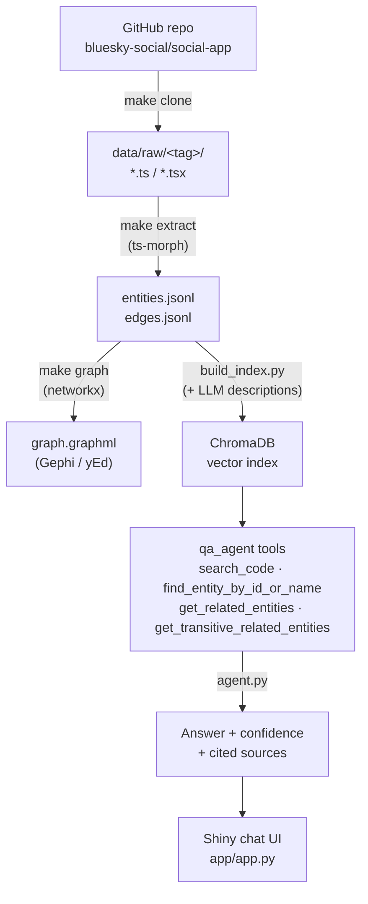

# CodeIQ — Source Code Knowledge Graph Assistant

Parse a real React / React Native codebase into a queryable knowledge graph, then a
semantic vector index on top of it — so a developer (or an LLM agent) can ask
plain-English questions about code structure, component relationships, and
impact, and get back answers grounded in real file paths and code snippets.

Built for HCLTech × UBC AI/ML , Developer Tooling /
Code Intelligence. Target codebase: [bluesky-social/social-app](https://github.com/bluesky-social/social-app)
(~100K lines, React Native + web).

## Demo

 

## Pipeline



`entities.jsonl` / `edges.jsonl` are the source of truth — `graph.graphml` and
the Chroma index are both *derived* from them independently, not from each
other. Every stage's output is namespaced under a `<tag>` folder
(`<owner>_<repo>_<branch>`, e.g. `bluesky-social_social-app_main`), computed
once as `TAG` in `src/clone_raw/clone_raw.py` and imported everywhere else, so
cloning/processing a second repo never collides with the first.

## Quickstart (Docker — no local setup)

The only prerequisite is [Docker Desktop](https://www.docker.com/products/docker-desktop/)
and a free [Groq API key](https://console.groq.com). One line runs the whole
pipeline (clone → parse → LLM descriptions → vector index):

```bash
git clone https://github.com/goudmani/codeiq_source_code_knowledge_graph.git
cd codeiq_source_code_knowledge_graph
echo "GROQ_API_KEY=your-key-here" > .env

docker compose up                # <- the one line that does all the processing
```

All outputs land in `./data/processed/<tag>/` on your machine (not trapped in
the container). The pipeline is resumable: Ctrl+C anytime and rerun — finished
work is skipped. Then explore the results:

```bash
docker compose up -d app         # chat UI     -> open http://localhost:8000
docker compose up -d jupyter     # JupyterLab  -> open http://localhost:8888
docker compose down              # stop everything
```

By default this processes bluesky-social/social-app (~1,650 files through the
LLM, roughly 70–90 min on Groq's free tier). To try a small repo first, or
process any other React/React Native repo, prefix commands with env vars:

```bash
REPO_OWNER=raysk4ever REPO_NAME=Simple-React-Native-App docker compose up
REPO_OWNER=raysk4ever REPO_NAME=Simple-React-Native-App docker compose up -d app
```

## Setup (local, without Docker)

0. Install manually (not provided by the conda environment):
   - [Conda](https://docs.conda.io/en/latest/miniconda.html) (Miniconda recommended)
   - [Node.js](https://nodejs.org/en/download) (for the ts-morph extractor)

1. Create the environment and install Node deps:

   ```bash
   conda env create -f environment.yml
   conda activate codeiq
   npm install
   ```

2. Add your Groq API key (used by the Q&A agent):

   ```bash
   echo "GROQ_API_KEY=your-key-here" > .env
   ```

   Optional: add `GROQ_API_KEY_2`, `GROQ_API_KEY_3`, … — the agent rotates
   to the next key when one hits a rate limit.

## Running the pipeline (local)

One line runs everything (the same stages `docker compose up` runs):

```bash
make all
```

Or stage by stage:

```bash
make clone      # download source -> data/raw/<tag>/
make extract    # parse with ts-morph -> data/processed/<tag>/{entities,edges}.jsonl
make graph      # load into networkx, export graph.graphml
make describe   # LLM one-line descriptions -> entities_with_desc.jsonl (needs GROQ_API_KEY)
make index      # build the Chroma vector index -> data/processed/<tag>/chroma/
```

Each step is independently re-runnable and reads only the previous step's
output. `TAG` is computed automatically from `REPO_OWNER`/`REPO_NAME`/`BRANCH`
env vars (defaults: bluesky-social/social-app/main), so
`REPO_OWNER=foo REPO_NAME=bar make all` processes a different repo.
`make describe` also accepts `LLM=local` (LM Studio) and
`DESC_ARGS="--num-files 10"` to limit a run.

### Building the vector index for a specific repo

Chroma indexes are **not** committed to git (they exceed GitHub's file-size
limit as they grow) — every machine builds them locally, and each repo gets
its own independent index at `data/processed/<tag>/chroma/`. One `make index`
run builds exactly one repo's index — whichever repo the env vars select:

```bash
make index                                                          # default repo (bluesky-social/social-app)
REPO_OWNER=raysk4ever REPO_NAME=Simple-React-Native-App make index  # a specific repo
```

Or name the tag directly, bypassing the env vars:

```bash
python src/vector_index/build_index.py --tag raysk4ever_Simple-React-Native-App_main
```

Building an index needs no API key or network — it embeds locally on CPU
(a few minutes for a large repo). The only prerequisite is that the earlier
pipeline stages have run for that repo, so
`data/processed/<tag>/entities_with_desc.jsonl` and `edges.jsonl` exist.
Verify an index with a test query:

```bash
python src/vector_index/query_index.py "which hook manages session state" --n 3   # default repo
python src/vector_index/query_index.py "toast hook" --tag <tag> --n 3             # specific repo
```

## Q&A agent

`src/qa_agent/` answers natural-language questions about the codebase using a
Groq-hosted LangChain agent with four tools:

| Tool | Purpose |
|---|---|
| `search_code` | Semantic search over the vector index — entry point for discovery questions |
| `find_entity_by_id_or_name` | Exact identifier lookup, for when a question names a specific entity |
| `get_related_entities` | 1-hop graph traversal (renders/calls/depends_on/defines) for one entity |
| `get_transitive_related_entities` | Multi-hop BFS for impact questions ("what breaks if X changes") |

Every answer gets a deterministic **High/Medium/Low confidence** level (from
retrieval relevance, not self-reported by the LLM) plus cited sources.

```bash
python -m src.qa_agent.agent "which hook manages session state?"
```

Or launch the chat UI:

```bash
shiny run app/app.py --reload
```

## Evaluation, cost & reliability testing

All three harnesses spend real Groq quota — run `make probe-quota` first.
Design notes: [docs/reliability-and-cost-testing.md](docs/reliability-and-cost-testing.md).

- **Answer quality** — 30 questions in 3 committed sets
  (`data/eval/questions*.json`). `make eval` runs set 1, `make eval-all` runs
  all three. A question is a hit if the cited sources include the expected
  entities. Latest: 1.0 / 1.0 / 0.8 per set (28/30), 0 errors — reports:
  [set 1](data/eval/RESULTS.md), [set 2](data/eval/RESULTS_2.md),
  [set 3](data/eval/RESULTS_3.md).
- **Token cost** — `make cost-eval`: one pass over the 30 questions, exact
  token counts per call, broken down by prompt type and message source →
  [COST_REPORT.md](data/cost/COST_REPORT.md). `make cost-plots` renders the
  charts → [data/cost/plots/](data/cost/plots) (offline).
- **Reliability** — `make reliability`: asks each of 10 fixed questions 3–5
  times and checks the runs agree (first tool, cited entities, confidence) →
  [RELIABILITY_REPORT.md](data/reliability/RELIABILITY_REPORT.md). Latest:
  6 PASS / 3 INCONCLUSIVE / 1 error (quota).

## Project structure

```
README.md / LICENSE / Makefile
environment.yml, requirements.txt      conda + pip dependency specs
package.json                           node deps (ts-morph)
Dockerfile, docker-compose.yml         container image + pipeline/app/jupyter services
docker/entrypoint.sh                   what `docker compose up` runs (all pipeline stages)
docs/
└── reliability-and-cost-testing.md   design notes for the cost/reliability harnesses

src/
├── clone_raw/
│   └── clone_raw.py                   stage 1 — download source repo, defines TAG
├── ts_extract/
│   ├── extract.mjs                    stage 2 — ts-morph parse -> entities/edges.jsonl
│   ├── add_descriptions_stepped.py    LLM-generated one-line entity descriptions
│   └── llm_config.json                backend config for the description step
├── build_graph/
│   └── build_graph.py                 stage 3 — networkx graph + GraphML export
├── vector_index/
│   ├── build_index.py                 stage 4 — builds the ChromaDB collection
│   └── query_index.py                 search_code() semantic search
└── qa_agent/
    ├── tools.py                        find_entity / get_related / get_transitive_related
    ├── agent.py                        ask() — LangChain tool-calling loop + confidence scoring
    ├── eval.py                         answer-quality harness over data/eval/questions*.json
    ├── cost_logger.py                  per-call token logging + prompt-type/source aggregation
    ├── cost_eval.py                    single-pass cost profile over the 30 eval questions
    ├── cost_plots.py                   renders the cost report as PNG charts
    ├── reliability.py                  self-consistency fingerprints + adaptive 3-then-5 sampling
    ├── reliability_eval.py             batch reliability runner (10-question subset)
    └── probe_quota.py                  checks configured Groq keys' quota

app/                                  Shiny chat UI over the qa_agent
├── app.py                             UI + server logic
├── file_utils.py                      reads live source from data/raw/<tag>/
├── render_utils.py                    HTML rendering for chat/source panels
└── www/                                static assets (JS, CSS, images)

img/demo.gif                          demo GIF (see Demo section above)
```

`data/`:

- `raw/<tag>/` — gitignored, regenerated with `make clone`
- `processed/<tag>/` — entities/edges (source of truth): `entities.jsonl`,
  `entities_with_desc.jsonl`, `edges.jsonl`; `graph.graphml` (derived, for
  Gephi/yEd); `chroma/` (derived ChromaDB store, gitignored);
  `add-descriptions-intermediate/` (checkpoint + LLM call log)
- [`eval/`](data/eval) — question sets + eval reports:
  [set 1](data/eval/RESULTS.md), [set 2](data/eval/RESULTS_2.md),
  [set 3](data/eval/RESULTS_3.md)
- [`cost/`](data/cost) — token/cost log,
  [report](data/cost/COST_REPORT.md) + [charts](data/cost/plots)
- [`reliability/`](data/reliability) — run results +
  [report](data/reliability/RELIABILITY_REPORT.md)

## Roadmap

- [x] Parse codebase into entities/edges (File, Component, Hook, Screen)
- [x] Knowledge graph (NetworkX) + GraphML export
- [x] Vector search index (ChromaDB, local embeddings + LLM-generated descriptions)
- [x] LLM Q&A agent with 1-hop and multi-hop (BFS) graph tools
- [x] Confidence scoring per answer
- [x] Answer-quality evaluation harness (30 questions across 3 committed sets)
- [x] Chat UI (Shiny, `app/app.py`)
- [x] Token/cost instrumentation + cost profile (`data/cost/`)
- [x] Self-consistency reliability harness (`data/reliability/`)
- [x] Demo GIF
