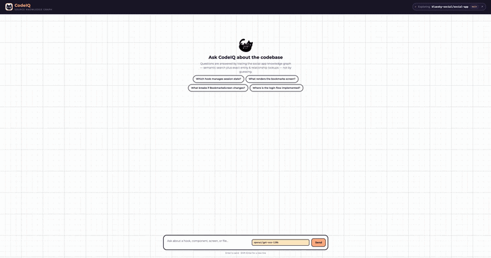
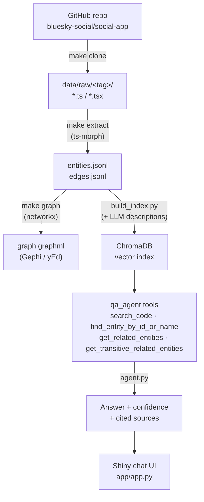

# CodeIQ — Source Code Knowledge Graph Assistant

Parse a real React / React Native codebase into a queryable knowledge graph, then a
semantic vector index on top of it — so a developer (or an LLM agent) can ask
plain-English questions about code structure, component relationships, and
impact, and get back answers grounded in real file paths and code snippets.

Built for HCLTech × UBC AI/ML , Developer Tooling /
Code Intelligence. Target codebase: [bluesky-social/social-app](https://github.com/bluesky-social/social-app)
(~100K lines, React Native + web).

## Demo

 

## Pipeline



`entities.jsonl` / `edges.jsonl` are the source of truth — `graph.graphml` and
the Chroma index are both *derived* from them independently, not from each
other. Every stage's output is namespaced under a `<tag>` folder
(`<owner>_<repo>_<branch>`, e.g. `bluesky-social_social-app_main`), computed
once as `TAG` in `src/clone_raw/clone_raw.py` and imported everywhere else, so
cloning/processing a second repo never collides with the first.

## Setup

0. Install manually (not provided by the conda environment):
   - [Conda](https://docs.conda.io/en/latest/miniconda.html) (Miniconda recommended)
   - [Node.js](https://nodejs.org/en/download) (for the ts-morph extractor)

1. Create the environment and install Node deps:

   ```bash
   conda env create -f environment.yml
   conda activate codeiq
   npm install
   ```

2. Add your Groq API key (used by the Q&A agent):

   ```bash
   echo "GROQ_API_KEY=your-key-here" > .env
   ```

## Running the pipeline

```bash
make clone      # download source -> data/raw/<tag>/
make extract    # parse with ts-morph -> data/processed/<tag>/{entities,edges}.jsonl
make graph      # load into networkx, export graph.graphml
python src/vector_index/build_index.py   # build the Chroma vector index (not yet a make target)
```

Each step is independently re-runnable and reads only the previous step's
output. `TAG` is computed automatically from `clone_raw.py`'s
`REPO_OWNER`/`REPO_NAME`/`BRANCH` (override via CLI flags or env vars).

## Q&A agent

`src/qa_agent/` answers natural-language questions about the codebase using a
Groq-hosted LangChain agent with four tools:

| Tool | Purpose |
|---|---|
| `search_code` | Semantic search over the vector index — entry point for discovery questions |
| `find_entity_by_id_or_name` | Exact identifier lookup, for when a question names a specific entity |
| `get_related_entities` | 1-hop graph traversal (renders/calls/depends_on/defines) for one entity |
| `get_transitive_related_entities` | Multi-hop BFS for impact questions ("what breaks if X changes") |

Every answer gets a deterministic **High/Medium/Low confidence** level (from
retrieval relevance, not self-reported by the LLM) plus cited sources.

```bash
python -m src.qa_agent.agent "which hook manages session state?" --model llama-3.3-70b-versatile
make eval   # run data/eval/questions.json against every model, write RESULTS.md
```

Or launch the chat UI:

```bash
shiny run app/app.py --reload
```

## Project structure

```
src/
├── clone_raw/        stage 1 — download source repo
├── ts_extract/        stage 2 — parse with ts-morph -> entities/edges.jsonl (+ LLM descriptions)
├── build_graph/       stage 3 — networkx graph + GraphML export
├── vector_index/      stage 4 — ChromaDB build/query
└── qa_agent/          stage 5 — LLM agent, tools, eval harness

app/                  Shiny chat UI over the qa_agent
data/
├── raw/               gitignored, regenerated with `make clone`
├── processed/<tag>/    entities/edges (source of truth), graphml + chroma (derived)
└── eval/               question set + eval reports
```

## Roadmap

- [x] Parse codebase into entities/edges (File, Component, Hook, Screen)
- [x] Knowledge graph (NetworkX) + GraphML export
- [x] Vector search index (ChromaDB, local embeddings + LLM-generated descriptions)
- [x] LLM Q&A agent with 1-hop and multi-hop (BFS) graph tools
- [x] Confidence scoring per answer
- [x] Answer-quality evaluation harness (10 questions x 2 Groq models)
- [x] Chat UI (Shiny, `app/app.py`)
- [ ] Demo GIF
