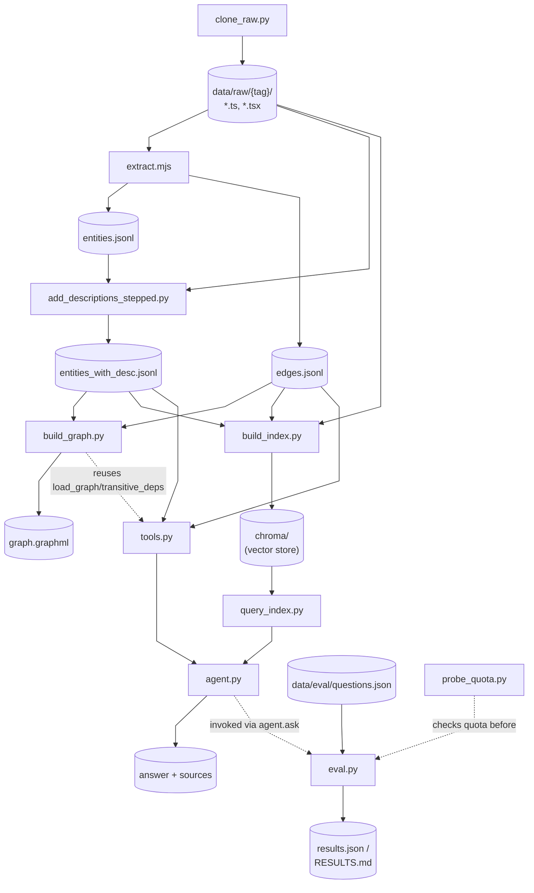

# Repository Details

## Pipeline Flowchart

Code files under `src/` only (`.py`/`.js`/`.mjs`); cylinders are the intermediate data files/folders each step reads or writes. `app/` (the frontend) is left out of this diagram -- see [2. Frontend: App](#2-frontend-app) below.



## 1. Backend: `src/`

To get started with the repository:

### Step 1: Clone repo

File: `src/clone_raw/clone_raw.py`

Sample Command (run from repo root):

```bash
python src/clone_raw/clone_raw.py --repo-owner raysk4ever --repo-name Simple-React-Native-App --branch main --force
```

- Downloads a GitHub repo as a zip (no `git` needed), keeps only `.ts`/`.tsx` files, and extracts them to `data/raw/<owner>_<repo>_<branch>/`, stripping GitHub's top-level `repo-branch/` folder so paths land as repo-relative.
- Input: `--repo-owner`/`--repo-name`/`--branch` (or `REPO_OWNER`/`REPO_NAME`/`BRANCH` env vars), `--force` to re-download and overwrite an existing folder (otherwise it's skipped if already present).
- Output: the `.ts`/`.tsx` tree under `data/raw/<tag>/`.
- `TAG = f"{repo_owner}_{repo_name}_{branch}"` is the folder tag every downstream step (extract/graph/vector-index/qa_agent) uses to namespace its own output for this repo+branch. `download_and_extract_ts_files()` does the actual streaming zip download + filtered extraction.

### Step 2: Parse and build graph

File: `src/ts_extract/extract.mjs`

Sample Command (run from repo root; `<tag>` is a positional arg, not a flag):

```bash
node src/ts_extract/extract.mjs raysk4ever_Simple-React-Native-App_main
```

- Walks the cloned `.ts`/`.tsx` tree with ts-morph and classifies every declaration (top-level or nested) by naming heuristic: `useX` -> Hook, `PascalCase` returning JSX -> Component, `PascalCase` ending in/living under `Screen(s)` -> Screen. Every source file itself also becomes a `File` entity.
- Input: `<tag>` positional arg -> reads `data/raw/<tag>/`.
- Output: `data/processed/<tag>/entities.jsonl` (one JSON object per File/Hook/Component/Screen, with `startLine`/`endLine`) and `data/processed/<tag>/edges.jsonl` (one object per relationship: `defines`, `depends_on` from imports, `renders` from JSX usage, `calls` from hook invocations -- each edge carries the line numbers it occurred on).
- Important functions: `registerDeclaration()` classifies+registers one declaration; `scanBody()` walks a declaration's body to find JSX tags (-> `renders`) and hook calls (-> `calls`), stopping at nested declarations so a parent doesn't double-claim a child's edges; `resolveModule()`/`resolveAndEmit()` resolve an import specifier to an internal file id or an `external:` package id.

File: `src/ts_extract/add_descriptions_stepped.py`

Sample Command (run from repo root):

```bash
python src/ts_extract/add_descriptions_stepped.py --tag raysk4ever_Simple-React-Native-App_main --llm remote
```

- For each source file, sends the file content plus its JSON entity list to an LLM and asks it to add a one-line `"description"` to each entity, validating that the response contains exactly the same entity ids/names as the input (no omissions/additions) before accepting it.
- Runs concurrently (`--max-workers`) behind a global pacer (`--min-interval`) so workers don't collectively blow through a backend's rate limit, with retry+backoff on 429s.
- Resumable: each successful file result is appended to a checkpoint file immediately, so killing/rerunning the script skips files already done and only retries failures. Every LLM call attempt (success or error, with latency/token usage) is logged separately.
- Input: `data/processed/<tag>/entities.jsonl` plus the raw source files under `data/raw/<tag>/`; `--llm local|remote` selects the backend (LM Studio vs Groq, per `llm_config.json`).
- Output: `data/processed/<tag>/entities_with_desc.jsonl` (final, merged), plus `data/processed/<tag>/add-descriptions-intermediate/{entities_raw_results.jsonl, llm_call_metrics.jsonl}` (checkpoint + call log).
- Important functions: `process_file()` (one file through the LLM with retries + JSON/entity-id validation), `Checkpoint`/`MetricsLog` (resumability + logging), `merge_descriptions()` (merges checkpointed descriptions back into the full entity list).

***Sample output of entities and edges*** 

`entities.jsonl` -- one line per File/Hook/Component/Screen:

```json
{"id":"App.tsx","type":"File","name":"App.tsx","file":"App.tsx","isScreenDir":false,"startLine":1,"endLine":33}
{"id":"App.tsx#App","type":"Component","name":"App","file":"App.tsx","kindGuess":"function","startLine":15,"endLine":30}
{"id":"routes.tsx#Routes","type":"Component","name":"Routes","file":"routes.tsx","kindGuess":"function","startLine":13,"endLine":36}
{"id":"hooks/usePosts.ts#usePosts","type":"Hook","name":"usePosts","file":"hooks/usePosts.ts","kindGuess":"function","startLine":6,"endLine":55}
```

`edges.jsonl` -- one line per `defines`/`depends_on`/`renders`/`calls` relationship:

```json
{"from":"App.tsx","to":"routes.tsx","type":"depends_on"}
{"from":"App.tsx","to":"App.tsx#App","type":"defines"}
{"from":"App.tsx#App","to":"external:react-native#SafeAreaView","type":"renders","external":true,"lines":[24]}
{"from":"App.tsx#App","to":"routes.tsx#Routes","type":"renders","unresolvedFileGuess":true,"lines":[26]}
{"from":"App.tsx#App","to":"external:react-native#useColorScheme","type":"calls","external":true,"lines":[16]}
```

After `add_descriptions_stepped.py` runs, `entities_with_desc.jsonl` has the same records plus a `"description"` field, e.g.:

```json
{
    "id":"App.tsx#App",
    "type":"Component",
    "name":"App",
    "file":"App.tsx",
    "kindGuess":"function",
    "startLine":15,
    "endLine":30,
    "description":"Root component function that renders the main application structure including routes and status bar."
}
```

File: `src/build_graph/build_graph.py`

Sample Command (run from repo root):

```bash
python src/build_graph/build_graph.py data/processed/raysk4ever_Simple-React-Native-App_main
```

- Loads `entities_with_desc.jsonl` + `edges.jsonl` into a traverse-friendly networkx `MultiDiGraph` (`load_graph()`), adding lightweight stub nodes for edge targets that weren't declared entities (external packages, unresolved files).
- Input: a processed-repo directory (positional arg, default `./out`) containing `entities_with_desc.jsonl` and `edges.jsonl`.
- Output: printed example query results (node/edge counts, top fan-in nodes, `who_uses("useSession")`), plus `graph.graphml` written into that same directory for opening in Gephi.
- Ships example queries reused elsewhere in the pipeline: `who_uses()` (incoming edges for a name match), `transitive_deps()` (BFS over one edge type/direction, up to `max_depth` hops -- reused by `tools.py`'s `get_transitive_related_entities`), `top_fan_in()` (most-depended-on nodes of a type, i.e. "core" candidates).

### Step 3: Create Vector Store

File: `src/vector_index/build_index.py`

Sample Command (run from repo root):

```bash
python src/vector_index/build_index.py --tag raysk4ever_Simple-React-Native-App_main
```

- Builds one ChromaDB document per entity: a header (type/name/file/description) + a human-readable "graph-context" sentence summarizing its `renders`/`calls`/`depends_on`/`defines` edges (both directions, capped preview) + its actual source snippet (`startLine`..`endLine`, read live from `data/raw/<tag>/`). Uses ChromaDB's default local embedding model (all-MiniLM-L6-v2 via ONNX) -- no API key or network call needed at index or query time.
- Input: `entities_with_desc.jsonl`, `edges.jsonl`, `data/raw/<tag>/` (all defaulted from `--tag`).
- Output: a persistent Chroma collection at `data/processed/<tag>/chroma`.
- Important functions: `build_documents()` (assembles text+metadata per entity), `describe()`/`fmt_edge()` (render the graph-context sentence), `load_adjacency()` (builds outgoing/incoming edge maps from `edges.jsonl`, also reused by `tools.py`).

### Step 4: Create Tools for QA Agent

File: `src/vector_index/query_index.py`

Sample Command (run from repo root):

```bash
python src/vector_index/query_index.py "which hook is used in toast.tsx" --tag raysk4ever_Simple-React-Native-App_main
```

- Semantic search over the Chroma collection built by `build_index.py`. Exposes `search_code()` as a plain importable function (no side effects, JSON-serializable output) so it can be wrapped as an LLM tool -- which is exactly what `agent.py` does.
- Input: natural-language `query`, `n_results`, optional `entity_type` filter (File/Component/Hook/Screen), `--tag` to pick the index.
- Output: a list of hit dicts, each with `id`/`type`/`name`/`file`/`start_line`/`end_line`/`snippet`/`description`/`graph_context`/`edges` (structured relation list)/`relevance` (0-1, from Chroma's cosine distance).
- Runnable directly as a CLI for sanity checks; internally caches one Chroma collection handle per `(chroma_dir, collection_name)` via `lru_cache`.

File: `src/qa_agent/tools.py`

Sample Commands (3 tools, run from repo root):

```bash
python src/qa_agent/tools.py find "usePosts" --tag raysk4ever_Simple-React-Native-App_main
python src/qa_agent/tools.py related "App.tsx#App" --edge-type renders --direction out --tag raysk4ever_Simple-React-Native-App_main
python src/qa_agent/tools.py transitive "routes.tsx#Routes" --edge-type depends_on --direction out --tag raysk4ever_Simple-React-Native-App_main
```

Three tools that complement `search_code()`, all returning hits shaped the same way (id/type/name/file/lines/description/...) so an agent can treat every tool's output uniformly as "sources":

- `find_entity_by_id_or_name` -- exact/near-exact id or name lookup (id match, then exact name, then substring), for when a question names a specific identifier and semantic similarity risks a near-miss (e.g. two different `useSessionId` hooks). Input: a `query` id/name + optional `entity_type`/`limit`/`tag`. Output: up to `limit` hit dicts.
- `get_related_entities` -- uncapped 1-hop graph traversal (`renders`/`calls`/`depends_on`/`defines`, either direction) for one entity, beyond `search_code()`'s capped 8-name preview. Input: an exact `entity_id` + optional `edge_type`/`direction`/`limit`/`tag`. Output: up to `limit` related-entity hit dicts, each tagged with `relation`/`direction`.
- `get_transitive_related_entities` -- multi-hop BFS (one relation/direction) reusing `build_graph.py`'s `load_graph()`/`transitive_deps()`, for "what breaks if X changes" / "what does X transitively depend on" questions in a single call. Input: an exact `entity_id` + `edge_type`/`direction`/`max_depth`/`limit`/`tag`. Output: up to `limit` hit dicts ordered by hop count (`depth` field).

### Step 5: QA Agent

File: `src/qa_agent/agent.py`

Sample Command (run from repo root):

```bash
python src/qa_agent/agent.py "which hook is used in toast.tsx" --tag raysk4ever_Simple-React-Native-App_main
```

- LLM-powered Q&A agent that wraps all four retrieval tools (`search_code` + the three in `tools.py`) and drives a bounded tool-calling loop (`MAX_TOOL_CALLS = 5`) against a Groq-hosted chat model. `ask(question, model, tag)` is the entry point; the CLI just calls it and prints the result.
- The repo/tag to query is resolved once per call and force-injected into every tool call server-side (`_bind_tag`), hidden from the schema the LLM sees -- the model can't omit or override it. Tool args are also clamped (`_clamp_tool_args`) to keep results under Groq's free-tier token-per-minute limits, and duplicate calls are deduped so a stuck model can't loop.
- Confidence (`High`/`Medium`/`Low`) is computed deterministically from `search_code`'s relevance scores (`_score_confidence`), not self-reported by the model, so it's reproducible.
- Input: a question string, `--model` (one of `MODELS`), `--tag`.
- Output: a dict with `answer`, `confidence`+`confidence_rationale`, `sources` (deduped hits from every tool call), `model`, `tag`, `latency_s`, `tool_calls` (full trace).
- `_invoke_with_retry()` rotates across multiple configured `GROQ_API_KEY[_N]` accounts on rate limits (each has an independent quota) before falling back to sleeping.

### Step 6: Evaluation

File: `src/qa_agent/eval.py`

Sample Command (run from repo root):

```bash
python src/qa_agent/eval.py --questions data/eval/questions.json --out-dir data/eval
```

> Note: `eval.py` has no `--tag` flag -- it always evaluates `agent.DEFAULT_TAG` (derived from the `REPO_OWNER`/`REPO_NAME`/`BRANCH` env vars, default `bluesky-social/social-app`), and the bundled `data/eval/questions.json` was written against that default repo's entities. To evaluate the smaller repo instead, write a matching question set and set `REPO_OWNER=raysk4ever REPO_NAME=Simple-React-Native-App BRANCH=main` before running.

- Runs a fixed set of self-generated questions through `agent.ask()` sequentially (to stay under rate limits), for one or more `--models`.
- Input: `--questions` (a JSON file, each entry with `question`/`expected_answer`/`expected_entities`), `--models` (one or more of `MODELS`), `--suffix` (to avoid overwriting a previous run's report).
- Output: `results<suffix>.json` (raw runs + per-model summary) and `RESULTS<suffix>.md` (human-readable report: summary table + per-question, per-model comparison), both under `--out-dir`.
- Scores each run by whether the cited sources overlap `expected_entities` (`entity_hit`), and flags "successful but empty" runs separately (`blank_answer`) so they can't hide inside the hit rate.

### Step 7: Cost Analysis

File: `src/qa_agent/cost_logger.py`

- Not a script -- the token/cost instrumentation layer imported by `agent.py` and the two runners below. Groq returns exact `prompt_tokens`/`completion_tokens` per LLM call for free (`response_metadata["token_usage"]`); `agent.ask()` captures that at its invocation site whenever a `cost_sink` is passed (default `None`, so existing callers are unaffected) and writes one JSONL record per call.
- What Groq does *not* give is attribution -- one combined prompt-token count, not how much came from the system prompt vs. a tool's results vs. the question. `estimate_char_shares()` fills that in by each message's share of the call's total prompt characters (an estimate, good enough for relative ranking). `classify_prompt_type()` buckets each question as `identifier_lookup`/`relationship`/`transitive_impact`/`discovery` -- the same taxonomy already implicit in the agent's system-prompt tool-selection rules, so cost is analyzed in the terms the agent itself reasons with.
- Important functions: `CostLogWriter` (JSONL appender), `load_cost_log()`, `aggregate_by_prompt_type()`/`aggregate_by_source()` (the two report tables), `cross_tab_intended_vs_actual()` (intended question type vs. the tool the agent actually called first), `write_cost_report()`.

File: `src/qa_agent/cost_eval.py`

Sample Command (run from repo root):

```bash
python src/qa_agent/cost_eval.py
```

- A single, non-repeated pass over the eval question sets with a `cost_sink` wired in -- the first cost profile at a fraction of the quota cost of any repeated-sampling run. Each run starts from a fresh cost log, and a failed question is logged and skipped, not fatal.
- Input: `--questions` (default: all three `data/eval/questions*.json` sets, 30 questions), `--model`, `--cost-log`, `--report`.
- Output: `data/cost/cost_log.jsonl` (one record per LLM call) and `data/cost/COST_REPORT.md` (tokens by prompt type, estimated tokens by source, intended-vs-actual first-tool cross-tab). From the committed run: the system prompt is 57.7% of all estimated tokens (it's resent on every call), `search_code` results 30.8%, and `identifier_lookup` questions are the priciest per question (~16.4K avg tokens).

File: `src/qa_agent/cost_plots.py`

Sample Command (run from repo root):

```bash
python src/qa_agent/cost_plots.py
```

- Renders the cost report's tables as two PNG charts (avg tokens per question by prompt type, stacked prompt/completion; avg tokens per question by source), reusing `cost_logger.py`'s aggregation functions rather than recomputing. Fully offline -- reads the JSONL log, no API calls. Needs `matplotlib`.
- Input: `data/cost/cost_log.jsonl`.
- Output: `data/cost/plots/tokens_by_prompt_type.png` and `tokens_by_source.png`.

### Step 8: Reliability (Redundancy) Testing

File: `src/qa_agent/reliability.py`

- Not a script -- the self-consistency (test-retest) library: ask the same question multiple times and check whether the agent's *decisions* agree across runs. LLM output varies run to run even at temperature 0, so exact answer-text match is the wrong bar -- structured decisions are compared instead.
- Each run is reduced to a `Fingerprint`: first tool called, cited entity ids, confidence level. Two runs agree if the first tool and confidence match exactly and the cited-entity sets overlap at Jaccard >= 0.7 (`ENTITY_JACCARD_THRESHOLD`, a starting default kept as one named constant).
- Adaptive sampling (`evaluate_reliability()`): run 3 samples; if all agree -> **PASS**, stop early (saves 2 calls). Otherwise run 2 more and verdict on all 5: >=4/5 agree -> **PASS**, 2-3/5 -> **INCONCLUSIVE**, <=1/5 -> **FAIL**.
- The design reasoning (why a custom harness over RAGAS/DeepEval/promptfoo, where the three-valued verdict and early stopping come from) is in `reports/reliability-and-cost-testing.md`.

File: `src/qa_agent/reliability_eval.py`

Sample Command (run from repo root):

```bash
python src/qa_agent/reliability_eval.py
python src/qa_agent/reliability_eval.py --ids q13 q15 --cost-log data/cost/partial.jsonl   # resume a partial run
```

- Batch runner for `evaluate_reliability()` over a fixed, hand-picked 10-question subset (spans all three prompt types that occur in the eval sets, deliberately excludes the three already-diagnosed eval misses), with cost tracking through the same `cost_sink`. Results are checkpointed after every question, and a failed question is recorded as `verdict: ERROR` instead of crashing -- a mid-run quota hit can't lose completed results.
- Input: `--ids` (question ids to run, default the full 10), `--cost-log` (pass a different path when resuming a partial run so it doesn't clobber prior records).
- Output: `data/reliability/reliability_results.json` + `RELIABILITY_REPORT.md`, plus a distinct "Reliability run" section appended to `data/cost/COST_REPORT.md` -- kept separate from the single-pass tables, since 3-5 repeated samples per question would skew those averages. First committed run: **6 PASS / 3 INCONCLUSIVE / 1 ERROR** (quota) across the 10 questions, 141 logged calls.

### Misc Files

File: `src/qa_agent/probe_quota.py`

- Cheap Groq quota check: sends a 1-token request per model/account and reports whether it's currently rate-limited, so an exhausted daily quota is caught for pennies before running a full `eval.py` (each real question costs ~2.5-3.5K tokens).
- Input: `--models` (subset of `MODELS`, default all), and the configured `GROQ_API_KEY[_N]` accounts.
- Output: prints one status line per account+model (`OK -- not rate limited` / `RATE LIMITED -- ...` / `BAD KEY -- ...`).

File: `src/ts_extract/llm_config.json`

- Not a script -- a config file read by `add_descriptions_stepped.py`'s `build_llm()`.
- Per-backend LLM connection settings (`base_url`, `model`, API key requirement/env var): `local` (LM Studio, no key needed) vs `remote` (Groq, needs `GROQ_API_KEY`).

## 2. Frontend: App

### 2.1 App Server `app/`

File: `app/app.py`

Run with (from repo root):

```bash
shiny run app/app.py --reload
```

A Shiny chat UI over `agent.ask()`. Every question is sent via `reactive.extended_task` (so the UI stays responsive while the agent runs), and the response's every field is surfaced: the answer, a deterministic confidence tag, a "more info" popover (model/latency/tool calls), tabbed sources with expandable code, and a per-answer `.md` export. Includes a repo selector (switches `tag`, e.g. between the two repos in `REPOS`) and a "view full file" modal that reads from `data/raw/<tag>/` on demand.

Supporting Files:

`app/file_utils.py`

Reads real source lines out of the locally-cloned `data/raw/<tag>/` (not just a possibly-truncated snippet) for the code panels and full-file modal, with a path-traversal guard and an `lru_cache`.

`app/render_utils.py`

Pure HTML/Markdown string builders (chat bubbles, confidence tag, source tabs, code blocks, `.md` export) that `app.py` wraps in `ui.HTML(...)` -- keeps Shiny's reactive wiring separate from string templating.

`app/www/style.css`

Website styles for the chat UI (dark theme, layout, badges, tabs, modal, etc).

`app/www/app.js`

Client-side interactivity (tabs, tooltips, expand/collapse, copy, `.md` download) via event delegation on the server-rendered markup, with no Shiny round-trip except "view full file" (which posts to a Shiny input since it needs to read a file from disk).

### 2.2 Deployment Files: Deploying on [Render.com](http://Render.com)

`docker/Dockerfile.deploy`

Lean image for deployment: no Node.js/ts-morph, no LLM-description step -- `entities_with_desc.jsonl`/`edges.jsonl` are already committed under `data/processed/`. It only clones the raw source and builds the Chroma index *at image build time* (baked into the image layers, never committed to git), then serves the Shiny app.

`.github/scripts/deploy_to_render.py`

Since the repo has neither the cloned source nor the Chroma DB checked in, they're constructed inside the Docker image (above); this script then syncs `GROQ_API_KEY[_N]` to the Render service's env vars and triggers a deploy pinned to the exact image digest just pushed (so Render can't accidentally run a stale `latest`).

`.github/workflows/publish.yml`

Runs on every push to `main`: builds `docker/Dockerfile.deploy`, pushes it to GHCR, then calls `deploy_to_render.py` with the pushed digest and the Groq keys from repo secrets.

`render.yaml`

Render Blueprint defining the web service as image-backed (pulls the GHCR image; Render never builds anything itself), with `autoDeploy: false` since the workflow above is the only deploy trigger.

`requirements.txt`

Pinned pip dependencies shared by the pipeline and the app (`numpy`, `networkx`, `langchain`/`langchain-openai`/`langchain-groq`, `chromadb`, `shiny`, `markdown-it-py`, `jupyterlab`).

## 3. Reproducibility

`environment.yml`

The full conda dev environment (Python 3.11 + Node.js, since `extract.mjs` needs both, plus `pandas`/`make`/`pytest`/`black`/`flake8` and the same pip packages as `requirements.txt`).

`requirements.txt`

Just the pip-installable packages (used standalone by `docker/Dockerfile.deploy`'s slimmer image, which has no conda/Node.js).

`package.json`

Packages required by js files in this repo.

> While `docker/Dockerfile.deploy` only copies files related to running the app, the files below are related to running the full pipeline on your local machine: they install Node.js (for `extract.mjs`) alongside the Python deps, so you can run the whole pipeline end to end, not just serve the pre-built app.

`Dockerfile`

Builds the full pipeline image (clone -> ts-morph extract -> LLM descriptions -> Chroma index); entrypoint runs `make all`.

`docker-compose.yml`

Three services sharing a `./data` volume -- `pipeline` (runs the full pipeline via the entrypoint, configurable via `REPO_OWNER`/`REPO_NAME`/`BRANCH`/`LLM`/`DESC_ARGS`), `app` (profile `app`; serves the Shiny UI on `:8000` over an already-built index), and `jupyter` (profile `jupyter`; JupyterLab on `:8888`, no token, for local exploration).

`docker/entrypoint.sh`

The container entrypoint -- checks `GROQ_API_KEY` is set when `LLM=remote` (the default), then execs `make all` so Docker and local runs stay guaranteed to do the same thing.
